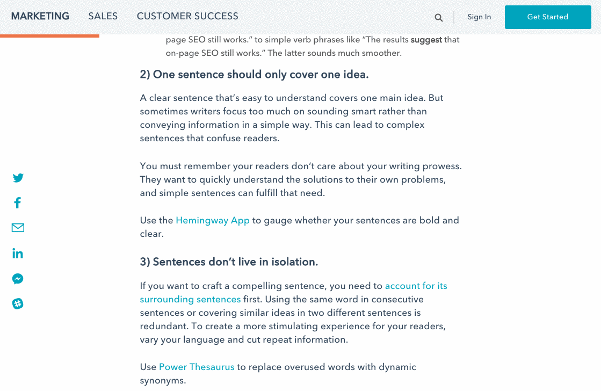

highlight-share
==========

Medium-like text selection sharing without dependencies

[](https://img.shields.io/github/license/anythingcodes/highlight-share.svg)



> Demo from the <a href="http://blog.hubspot.com" target="_blank">HubSpot blog</a>

## Purpose

This lightweight library allows to create a simple interface to share selected text in a page, in the form of a small popover over the selected portion of text.

Features:

* customizable sharing channels ("sharers")
* restriction on selected elements
* customizable CSS classes and stylesheets
* hooks on opening and closing the popover, and on sharing action

All in a tiny library (less than 1.8 KB minified and gzipped, plus less than 0.5 KB for the optional provided style sheet and 0.5-1.3 KB for the sample sharers).

## Installation

Via npm:

```bash
$ npm install --save highlight-share
```

## Usage

After installing, import the library using the module loader of your choice:

```javascript
// CommonJS
const highlightShare = require('highlight-share');

// ES6
import highlightShare from 'highlight-share';

// AMD
define([ 'highlight-share' ], highlightShare => {
    // ...
});

// Global
var highlightShare = window.highlightShare;
```

Import any sharers you need:

```javascript
import * as twitterSharer from 'highlight-share/dist/sharers/twitter';
import * as facebookSharer from 'highlight-share/dist/sharers/facebook';
import * as emailSharer from 'highlight-share/dist/sharers/email';
import * as copySharer from 'highlight-share/dist/sharers/copy';
import * as linkedInSharer from 'highlight-share/dist/sharers/linked-in';
import * as facebookMessengerSharer from 'highlight-share/dist/sharers/facebook-messenger';
```

Note that Facebook Messenger also requires a Facebook app ID, for example the `abc123` string here:

```javascript
const messengerShare = new facebookMessengerSharer.FacebookMessenger('abc123');
```

Create a variable specifying a DOM element `selector` and an array of your `sharers`:

```javascript
const selectionShare = highlightShare({
    selector: '#shareable',
    sharers: [twitterSharer, facebookSharer, emailSharer, linkedInSharer, messengerShare, copySharer]
});

selectionShare.init();
```

Note: If the `sharers` array is empty, nothing will happen.

## Options

The options for the `highlightShare` factory include:

* `document`: the `Document` object to apply the sharing functionality (default: `document`);
* `popoverClass`: the class name (or names) to be used in the root element of the popover (default: `highlight-share-popover`);
* `selector`: restricts the shared text to the contents of the elements matching `selector` (default: `"body"`);
* `sharers`: an array of sharing channels (Twitter, Facebook, email...); see later for details;
* `shareUrl`: a reference URL for the shared text (default: the `location` object of the `document` property);
* `transformer`: a function that transforms the extracted selected text (default: a function that trims and collapses whitespaces);
* `onOpen`: a function that gets called when the sharing popover is opened. The popover's element, the transformed selected text and its original version are passed as arguments;
* `onClose`: a function that gets called when the sharing popover is closed.

When you're done sharing text, you can call the `destroy` method;

```javascript
selectionShare.destroy();
```

A destroyed sharing object can *not* be `init`ialized again.

## What is a sharer?

A "sharer" is an object with just one mandatory method: `render`, that must return the HTML string of the sharing button;
and a `name` property.

Note that Facebook Messenger also requires a Facebook app ID, for example the `abc123` string here:

```javascript
const messengerShare = new facebookMessengerSharer.FacebookMessenger('abc123');
```

### Sharer Functions

### `render(text, rawText, shareUrl)` (mandatory)

This function receives these arguments:

* `text`: the text that should be shared;
* `rawText`: the original selected text content (i.e., not mangled by the `transformer`);
* `shareUrl`: the reference URL to be shared (see the options).

It must return the HTML of the button/link/element that should provide the required sharing functionality.

### `name` (mandatory)

A unique string (among the sharers) that identifies the sharer (e.g.: `"twitter"`, `"facebook"`, ...).

### `active(text, rawText)` (optional)

This property could actually be a function (with the above signature) or a boolean, stating if the sharer is enabled (`true`) or not.
If it's a function, it should return a truthy or falsy value, with the same meaning.

### `action(event, item)` (optional)

A function to be called when the user clicks/taps on the sharing button. The `event`'s default is *not* prevented. `item` is the
`<li>` element that wraps the sharer's button.


## Using the sharers


The following are the default basic sharers provided by the package:

Site     | File location               | Name        | Global variable
---------|-----------------------------|-------------|-----------------------
Twitter  | `dist/sharers/twitter.js`   | `twitter`   | `highlightShareViaTwitter`
Facebook | `dist/sharers/facebook.js`  | `facebook`  | `highlightShareViaFacebook`
Facebook Messenger | `dist/sharers/facebook-messenger.js`  | `facebook-messenger`  | `highlightShareViaFacebookMessenger`
LinkedIn | `dist/sharers/linked-in.js` | `linked-in` | `highlightShareViaLinkedIn`
Reddit   | `dist/sharers/reddit.js`    | `reddit`    | `highlightShareViaReddit`
Email    | `dist/sharers/email.js`     | `email`     | `highlightShareViaEmail`
Copy    | `dist/sharers/copy.js`     | `copy`     | `highlightShareViaCopy`

The list of the sharers is also available on the `sharers` property on the popover element (e.g. passed to the `onOpen` callback), for dynamic
runtime handling.

## Tips

### Mobile devices

On mobile browsers, you might not want to have `highlight-share` to interfere with native sharing features, so you might want it disabled. In order
to it, you might want to do something like this:

```js
if (!window.matchMedia
        || !window.matchMedia('(pointer: coarse)').matches) {
    selectionShare.init();
}
```

(Why `pointer: coarse`? If the device's primary pointer is "coarse" — that includes touch devices, but also Kinect and WiiMotes - then the
device _probably_ features a native sharing interface. See [CanIUse](http://caniuse.com/#feat=css-media-interaction) for details about Interaction
Media Features. If the browser doesn't support `window.matchMedia` altogether, then it's _probably_ a PC with a mouse/trackpad, so it's fine to
initialize `highlight-share`.)

Keep in mind that native sharing features let the _device_ do the job, using apps or services installed on it, `highlight-share` keep this task on the page, meaning it could offer "sharing" capabilities that the device may not have (e.g.: "save to my account's notes" or "pronounce this using
voice synthesis"), so you might want to show _both_ native and custom sharing interfaces.

### ES2015 (ES6)

This library's source code (that can be found in the [src](src/) folder) uses ES2015 profusely, including ES2015 module definition and loading. Therefore, at the moment, its modules can't be `require`d without prior transpilation. This also mean that this library is ready for when environments will finally support ES2015 modules. :tada:

The `"module"` property is defined in [package.json](package.json) for those module loaders that support it. ([Rollup](https://github.com/rollup/rollup), for example, which is also used to bundle the library).

Source files for style sheets are also provided in both [LESS](style/less) and [SCSS](style/scss) form.

## Browser support

* Chrome/Opera
* Firefox 52+ (1)
* Edge
* Safari 10+ (2)
* Internet Explorer 9+

Notes:

1. Firefox version 51 and below lacks support of the [`selectionchange` event](https://developer.mozilla.org/en-US/docs/Web/Events/selectionchange).
1. Safari version 9 and below lacks support of the [`execCommand('copy')` event](https://developer.mozilla.org/en-US/docs/Web/API/Document/execCommand#Browser_compatibility). If you aren't using the `copy` sharer, Safari support is version 5.1 and above.

## To do

* More tests (with headless browsers)
* More test coverage
* Fine-tune Babel
* Support for JSX in sharers' `render` method
* Update ESLint rules to use Airbnb package


## License

MIT @ Liz Shaw 2017-2018. See [LICENSE](LICENSE). Project based on [share-this](https://www.npmjs.com/package/share-this).
